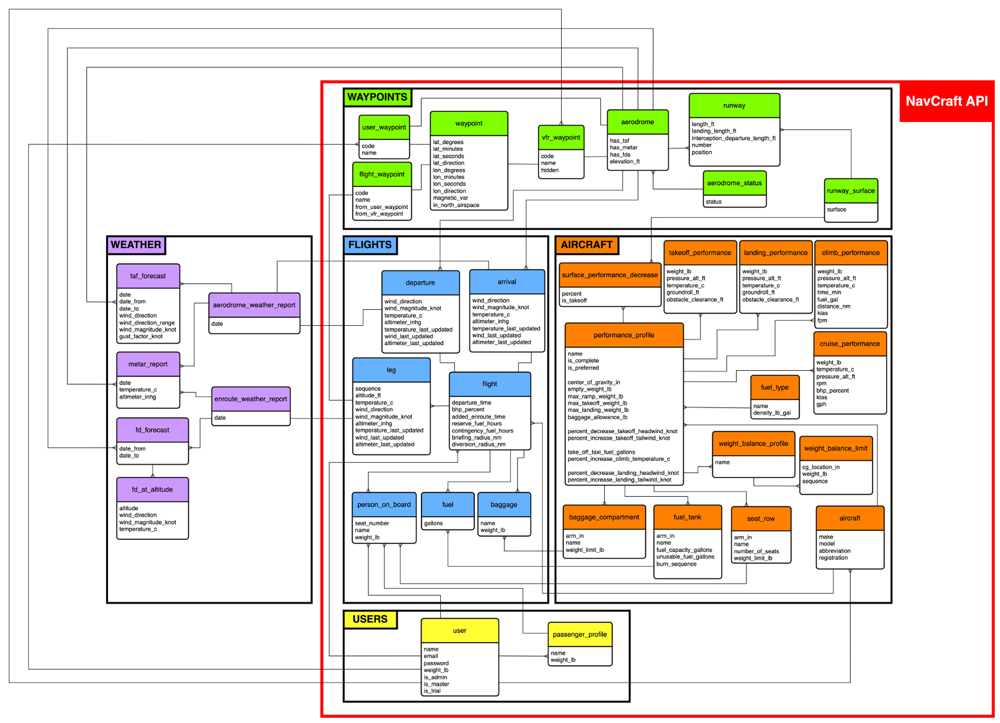

[](https://navcraftapi.com/docs)

_<center>_

### Helping pilots craft the perfect navigation flight plans

[Motivation](#motivation) • [Quick Start](#quick-start) • [Usage](#usage) • [Contributing](#contributing)

</center>

NavCraft API uses aircraft performance data, and Canadian aviation rules, regulations and definitions, to produce VFR flight plans that include:

- navigation logs,

- weight and balance graphs and calculations,

- fuel calculations,

- takeoff and landing distances.

# <a id="motivation"></a> 🌟 Motivation

NavCraft API was developed with one goal:

> Minimize flight planning time.

As a student pilot, I spend hours preparing and amending flight plan calculations. Fortunately, with the right physics knowledge, mathematical tools and a little computer magic; most of those calculations can be automated.

With NavCraft API, pilots can pre-save airports, waypoints and aircraft performance data into their profile preferences. Allowing them to craft complete VFR flight plans on the spot, in seconds.

# <a id="quick-start"></a> 🚀 Quick Start

The API is live. Navigate to the documentation on [navcraftapi.com/docs](https://navcraftapi.com/docs)

# <a id="usage"></a> 👨‍💻 Usage

To use NavCraft API as the backend of your flight planning web, mobile or desktop app; make API calls using the API’s URL, followed by the endpoint’s route. For example, to request the navigation log of the flight with ID 352, you call:

```
https://navcraftapi.com/api/flight-plans/nav-log/352
```

In the [documentation](https://navcraftapi.com/docs), you can find a list of all the exposed endpoints, with a brief description of what they do, and detailed schemas of the request and response data structures.

Be aware, that some endpoints can only be used by admin users, and others are only meant to be used by the master user. Whenever this is the case, it will say so in the endpoint’s description.

##  API Architecture

Understanding the API’s architecture will help you navigate it better. NavCraft API was written using the FastAPI Python library. The backbone of the API is divided into two main parts, its database and a directory of Python functions. Sounds obvious, but let’s look into each one of them in more detail:

###  The Database

NavCraft API relies on a MySQL database. As shown in the conceptual model diagram below, the database is divided into three main groups; Users, Waypoints, Aircraft and Flights.
> [!NOTE]
> The original database design is shown inside the red box in the conceptual diagram. The Weather group was added to it afterwards, as part of the design of the [NavBrix API](https://navbrixapi.com/docs); an API that adds weather briefing capabilities to the NavCraft API.



1. **Users**

   The user entity holds the users' profile data. Additionally, each user can save a list of their most frequent passengers, so they can be effortlessly included in the weight and balance of each flight.

2. **Waypoints**

   A waypoint is a point over the surface of the earth, described by latitude and longitude. Four entities branch out of the waypoint entity:

   - **vfr_waypoints** are officially published waypoints. Only admin users can add, delete and edit them, and if they are not hidden, any user can add them to their flight routes.
   - **user_waypoints**, on the other hand, can be added by any user, but only the owners can see them and add them to their flights. Allowing pilots to save their most frequented waypoints, and reuse them in all their flights.
   - **flight_waypoints** are waypoints linked to a specific flight. Whenever a user adds a waypoint to a flight, its data gets copied into a separate table, so that the flight doesn't get corrupted whenever the waypoint is edited or deleted.
   - **aerodromes** are waypoints with additional information like runways, elevation and weather reports available. As waypoints, aerodromes can also be official, or private to each user.

3. **Aircraft**

   There are three main entities in the aircraft group:

   - **aircraft:** Every user can save a list of aircraft, which they can use for their flights.

   - **performance_profiles** contain the performance data of the aircraft. Each aircraft can have up to three performance_profiles, that describe different configurations of the same aircraft.

   - **models** are not an entity in itself. They are performance_profiles that are not assigned to a specific aircraft. Models can only be added by admin users and they are visible to all users. Whenever users add a performance_profile to an aircraft, they can choose to copy it from an existing model.

   All the other entities in this group, hold the performance data and are linked to the performance_profile entity.

4. **Flights**

   This is the most important group of the API, and it's connected to all other groups. The entities in this group, hold the data required by the Python functions, to make flight plan calculations. All flights must have:

   - an aircraft,
   - a departure point,
   - an arrival point,
   - a list of legs,
   - a list of persons on board,
   - a list of baggage,
   - a list of fuel carried per tank

###  Python Functions

NavCraft API was written in Python because of the existence of scientific libraries like NumPy, which was used to write linear algebra algorithms. The result is an API that, not only enables the standard CRUD operations to interact with the database, but also runs vector equations over spherical coordinates, coordinate system rotations using rotation matrices, and recursive table lookups; to use the data stored in the database, to make navigation, fuel, weight & balance and takeoff and landing distance calculations.

# <a id="contributing"></a> 🤝 Contributing

Currently looking for help to work on the following features/issues, in order of urgency:

### 1. Issues 🐞

If you find a bug or a feature you want to implement, please raise an issue and submit a pull request. Your contributions are greatly appreciated.

### 2. Testing

The first version of the NavCraft API does not have tests in place. As I am looking to grow the API and add more features to it; I want to implement unit and integration tests, using the [Pytest](https://docs.pytest.org/en/8.0.x/) library.

The _functions_ directory contains three modules, which include some of the most important reusable functions of the API. The first step will be to implement unit tests for all the functions in the directory, and then implement integration tests to cover any functionality gaps left untested in the functions that read/write to the database. Please follow the [FastAPI testing documentation](https://fastapi.tiangolo.com/tutorial/testing/).

If as part of implementing these tests, you consider refactoring the code is appropriate, your contributions are also welcome.

### 3. Async database 

NavCraft API uses SQLAlchemy as an ORM to interact with a MySQL database. This configuration is inherently synchronous. As FastAPI uses multithreading to make synchronous operations faster, this didn't seem to be much of a problem for the first version of the API. However, I then realized that changing to an asynchronous configuration will require major changes to the code, which will get worse as the API grows.

So, before adding new features to the API, I want to use [encode/databases](https://github.com/encode/databases) to implement Asyncio support to the database calls, and make the API asynchronous.

### 4. Airspace data 🌎

I have been planning to grow the database to include geographical data on airspaces, navigation aids, flight service stations, airways and/or air routes. This will include data like the geographical coordinates that describe the airspace, the type of airspace, relevant altitudes and the type of services provided.

To work on this feature, you need to have a good understanding of geometry, spherical and geographical coordinates. Also, a basic understanding of navigation and Canadian airspace will be useful.

Helpful resources:

- Designated Airspace Handbook - [download here](https://www.navcanada.ca/en/aeronautical-information/operational-guides.aspx)

- Transport Canada Aeronautical Information Manual - [download here](https://tc.canada.ca/en/aviation/publications/transport-canada-aeronautical-information-manual-tc-aim-tp-14371)

## 🛠 How to contribute

If you would like to work on any of the contributions mentioned above, follow the steps below.

> [!IMPORTANT]
> To run the code locally in development mode, you'll need to have [](https://docs.docker.com/get-docker/) installed on your machine.

### 0. Read the Open Source Guide 📑

This is an optional step, but a helpful one. If in doubt, follow the guidelines in the [Open Source Guide](https://opensource.guide/how-to-contribute/).

### 1. Browse the open issues 🔎

Check if someone else is already working on a similar feature. If there is an open issue you want to work on, and it hasn't been claimed, tag me in a comment to let me know you want to claim it.

If there is not an open issue related to the feature you want to work on, open a new one. Leave a detailed description of what you want to implement, and tag me on it. Add descriptive labels if appropriate.

### 2. Fork the repo 🔱

Once the issue has been assigned to you, set up the repository on your local machine.

- Fork the repository into your GitHub account.

- Clone the repo in your local machine.

  ```bash
  git clone https://github.com/<your_github_username>/navcraft-api.git
  ```

- Start a feature branch.

  ```bash
  cd navcraft-api
  git switch -c <feature_or_bugfix>/<feature_name>
  ```

### 3. Run the Docker container 

Once you've created a new feature branch, you can start working on the code. The repository has a `Dockerfile.dev` and `docker-compose.dev.yml` file to run in development mode:

- First, you can adjust the default environment variables of the project in the `docker-compose.dev.yml` file.

  | ENV_VARIABLE                        | SERVICE    | COMMENT                                                   |
  | ----------------------------------- | ---------- | --------------------------------------------------------- |
  | `MYSQL_ROOT_PASSWORD`               | _database_ | Database password.                                        |
  | `MYSQL_DATABASE`                    | _database_ | Name of the database.                                     |
  | `NAVCRAFT_API_DB_PASSWORD`          | _app_      | Database password. Must equal `MYSQL_ROOT_PASSWORD`       |
  | `NAVCRAFT_API_DB_HOST`              | _app_      | IP or domain where the database is running.               |
  | `NAVCRAFT_API_DB_NAME`              | _app_      | Name of the database. Must equal `MYSQL_DATABASE`         |
  | `NAVCRAFT_API_MASTER_USER_NAME`     | _app_      | Name of the master user to migrate into the database.     |
  | `NAVCRAFT_API_MASTER_USER_EMAIL`    | _app_      | Email of the master user to migrate into the database.    |
  | `NAVCRAFT_API_MASTER_USER_WEIGHT`   | _app_      | Weight of the master user to migrate into the database.   |
  | `NAVCRAFT_API_MASTER_USER_PASSWORD` | _app_      | Password of the master user to migrate into the database. |
  | `NAVCRAFT_API_JWT_SECRET_KEY`       | _app_      | Secret key used to sign and verify JWTs.                  |
  | `NAVCRAFT_API_JWT_ALGORITHM`        | _app_      | Algorithm used to sign and verify JWTs.                   |
  | `NAVCRAFT_API_SENTRY_DSN`           | _app_      | DSN used to track the project's issues on Sentry.         |

- Next, build the docker images and run the docker container:

  ```bash
  docker-compose -f docker-compose.dev.yml build
  docker-compose -f docker-compose.dev.yml up -d
  ```

- Finally, troubleshoot. If the docker container doesn't run properly on the first try, it's most likely due to a docker network problem, or because any of the ports are occupied.

  - First, try restarting the app container, this will solve the network problem:

    ```bash
    docker restart navcraft-api-app-1
    ```

  - If the container keeps crashing because a port is occupied, open the `docker-compose.dev.yml` file and adjust the mapped ports. The default ports are:

    | SERVICE    | CONTAINER PORT | MAPPED TO |
    | ---------- | -------------- | --------- |
    | _database_ | 3306           | 3307      |
    | _app_      | 8000           | 8000      |

- The services will run on the localhost `127.0.0.1` and their respective port. NavCraft API, for example, will run on:

  ```
  http://127.0.0.1:8000
  ```

> [!TIP]
> The `/src` directory in the host, is being mapped to the `/src` directory in the container. Thus, any changes you save will be automatically shared to the container. However, the `pipfile` and `pipfile.lock` files are not being mapped. If you install a new library, you'll need to rebuild the image for it to show in the container.

### 4. Submit a pull request 

After committing your code following commit best practices, you're ready to submit your changes.

- First, push the changes to your forked repo.

  ```bash
  git push origin <feature_or_bugfix>/<feature_name>
  ```

- Then, open a pull request to the `main` branch.
